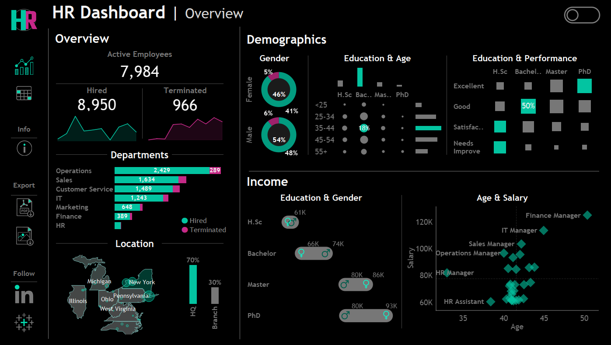
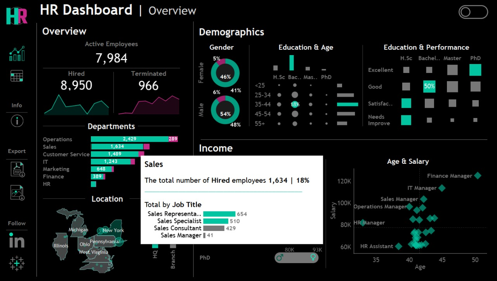
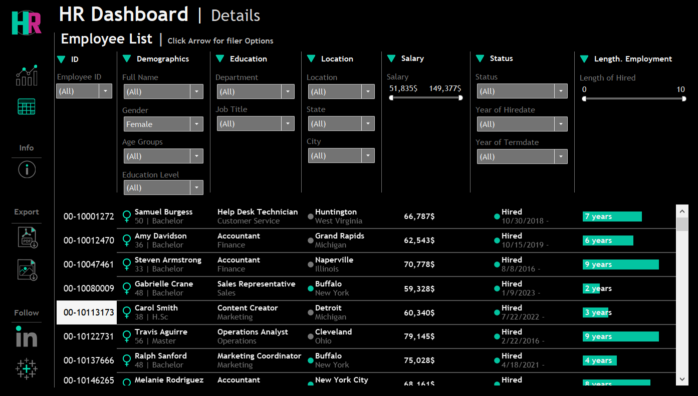
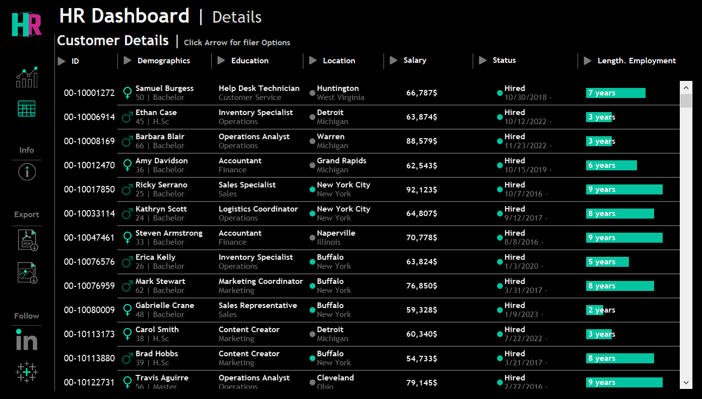

## 📊 HR Tableau Dashboard
This project showcases an interactive Tableau dashboard designed for visualizing key HR metrics. It provides a comprehensive overview of hiring trends, terminations, department-wise recruitment, employee demographics, performance analysis, and compensation insights — helping HR professionals make data-driven decisions.

## 📌 Dashboard Overview
The dashboard answers essential HR questions such as:
- How many employees were hired vs terminated over time?
- Which departments are hiring the most?
- What are the gender, age, and education-level distributions among new hires?
- How does performance vary across different education levels?
- What are the highest-paid positions in the organization?

## 🧩 Key Features
- Hiring vs Termination Trends
- Hiring by Department, Gender, Age, and Education
- Performance by Education Level
- Top Paid Positions
- Interactive Filters for drilling down by department or time period
- Tooltips for detailed context on hover

## 📷 Dashboard Screenshots

## Full overview

## Employee List

## 🌐 View Live Dashboard

You can view the full interactive dashboard on Tableau Public:  
https://public.tableau.com/app/profile/mona.rizq/viz/HrDashboard_17539214320820/HRDetails

## 🙋‍♂️ Author
- [Mona Rizq]
- Data & Analytics Engineer

  

